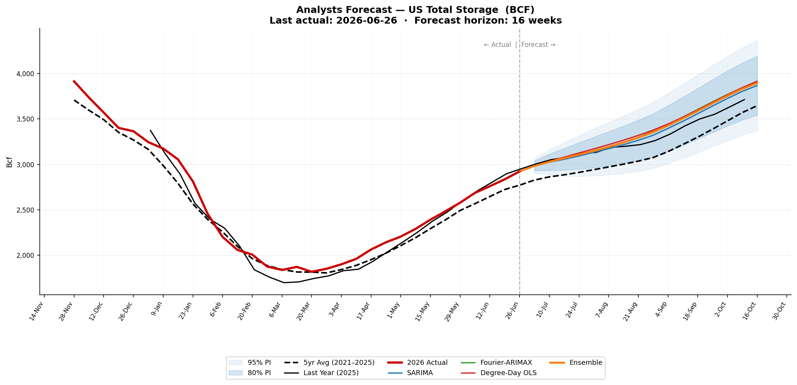
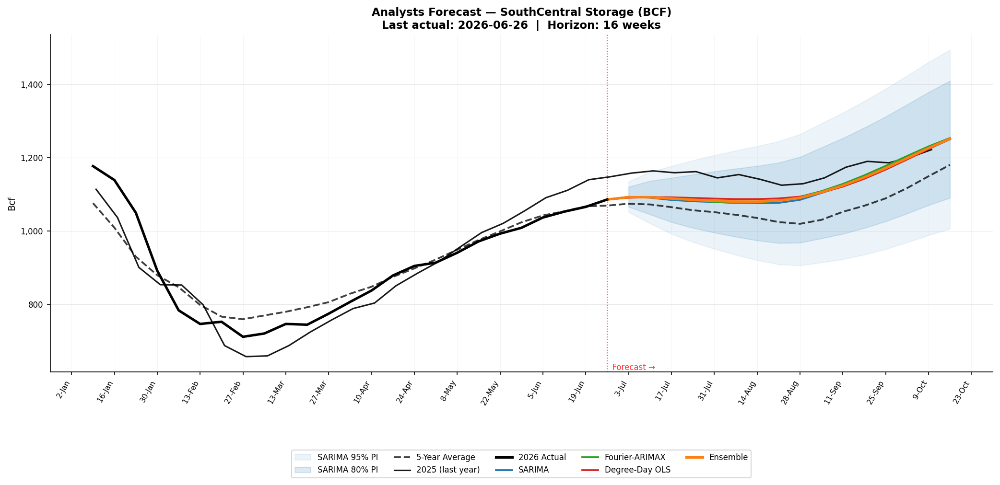

# Natural Gas Storage Analysis
## Mehrdad Heyrani (https://www.linkedin.com/in/mehrdad-heyrani/)
## Overview
This notebook performs a comprehensive analysis and forecasting of natural gas storage, covering data preprocessing, seasonal analysis, multi-model forecasting, and visualization. The workflow processes the `gas_realized.xlsx` dataset to generate seasonal overlays, multi-model forecast fans, Z-score charts, and a forecast summary table.

## Installation
All necessary Python libraries can be installed using `pip`:

```bash
pip install arch pyvinecopulib openpyxl statsmodels scipy pandas numpy matplotlib seaborn scikit-learn tqdm prophet
```

## Key Features
*   **Seasonal Overlay**: Year-over-year storage overlay per region and total.
*   **Multi-Model Forecasting**: Utilizes SARIMA, Fourier-ARIMAX, Holt-Winters, and Degree-Day OLS models to forecast natural gas storage.
*   **Analyst-Style Forecast Fan**: Visualizes multi-model forecasts with confidence intervals.
*   **Z-Score Analysis**: Displays surplus/deficit relative to the 5-year average.
*   **Output**: All charts and a forecast summary table are saved to the `/content/` directory.

## Outputs
```
── Forecast Summary Table — Total Storage ──
      Week  WoY  5yr_Avg  SARIMA  Fourier-ARIMAX Holt-Winters  Degree-Day OLS  Ensemble  vs_5yr
2026-07-03   27   2827.0  2984.0          2982.0         None          2980.0    2982.0   155.0
2026-07-10   28   2862.0  3024.0          3029.0         None          3032.0    3028.0   166.0
2026-07-17   29   2885.0  3055.0          3068.0         None          3079.0    3068.0   183.0
2026-07-24   30   2911.0  3092.0          3105.0         None          3125.0    3107.0   196.0
2026-07-31   31   2941.0  3132.0          3143.0         None          3170.0    3148.0   207.0
2026-08-07   32   2971.0  3172.0          3187.0         None          3217.0    3192.0   221.0
2026-08-14   33   3002.0  3216.0          3238.0         None          3266.0    3240.0   238.0
2026-08-21   34   3035.0  3264.0          3298.0         None          3319.0    3293.0   258.0
2026-08-28   35   3075.0  3320.0          3365.0         None          3377.0    3354.0   279.0
2026-09-04   36   3140.0  3395.0          3440.0         None          3444.0    3426.0   286.0
2026-09-11   37   3219.0  3473.0          3520.0         None          3519.0    3504.0   285.0
2026-09-18   38   3300.0  3557.0          3604.0         None          3599.0    3587.0   287.0
2026-09-25   39   3388.0  3642.0          3688.0         None          3682.0    3671.0   283.0
2026-10-02   40   3478.0  3725.0          3769.0         None          3765.0    3753.0   275.0
2026-10-09   41   3569.0  3803.0          3842.0         None          3844.0    3829.0   260.0
2026-10-16   42   3645.0  3866.0          3900.0         None          3915.0    3894.0   249.0
```


*   `Chart1_<region>_seasonal_overlay.png`: Year-over-year overlay for each region.
*   `Chart1_all_regions_combined.png`: Combined seasonal overlay for all regions.
*   `Chart2_<region>_forecast_fan.png`: Analyst-style forecast fan for each region.
*   `Chart2_Total_analyst_style.png`: Detailed analyst-style forecast for total storage.
*   `Chart3_surplus_deficit_zscore.png`: Z-score heat gauge showing storage surplus/deficit.
*   `Forecast_table_Total.csv`: A tabular summary of the total storage forecast.

## Data Source
EIA Weekly Underground Storage data.
## Results Preview
EIA Weekly NG Storage
 

Model Forecast
 

 


